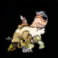
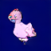
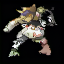
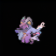
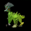
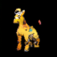

# Pokémon Diffusion Model

This repository contains a diffusion model for generating Pokémon images. The model generates images from random noise, allowing the creation of unique Pokémon-like creatures. The application uses a Streamlit web interface for easy interaction.

## Generated Pokémon Examples

Here are some examples of Pokémon images generated by the model:

<p align="center">
    
    
    
    
    
    

</p>

## Features

- Generate Pokémon images from random noise using a diffusion model.
- Save generated images to your local machine.
- Dockerized application for easy setup and deployment.

## Table of Contents

1. [Installation](#installation)
2. [Usage](#usage)
3. [Examples](#examples)
4. [Saving Generated Images](#saving-generated-images)
5. [Development](#development)
6. [License](#license)

## Installation

To get started with the Pokémon diffusion model, follow these steps:

1. **Clone the repository**:

    ```bash
    git clone https://github.com/yourusername/your-pokemon-diffusion.git
    cd your-pokemon-diffusion
    ```

2. **Build the Docker image**:

    Make sure Docker is installed on your system. Then run:

    ```bash
    docker build -t pokemon-diffusion .
    ```

3. **Run the Docker container**:

    ```bash
    docker run -p 8501:8501 pokemon-diffusion
    ```

4. **Access the application**:

    Open your web browser and navigate to `http://localhost:8501` to start generating Pokémon images.

## Usage

Once the application is running:

1. Click the "Generate Pokémon" button to create a new Pokémon image from noise.
2. A progress bar will show the generation process.
3. The generated image will be displayed on the page.
4. You can save the generated image by clicking the "Save Image" button.